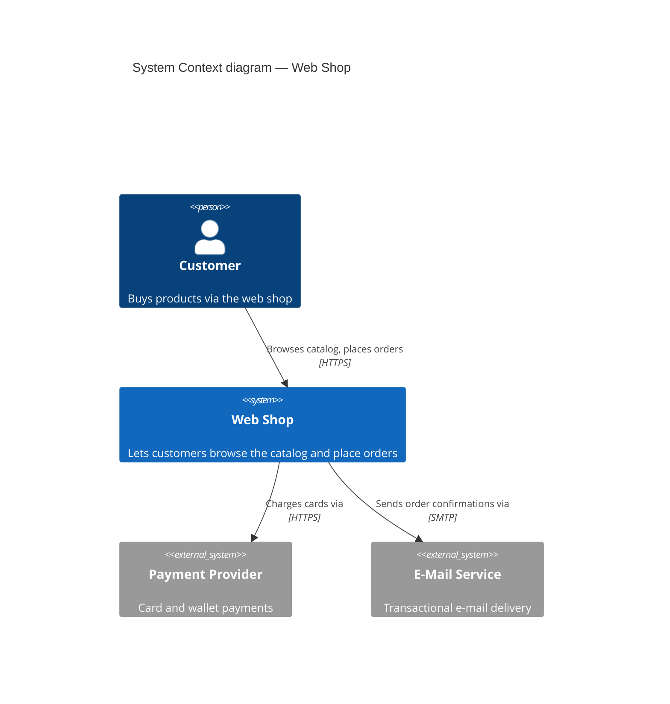
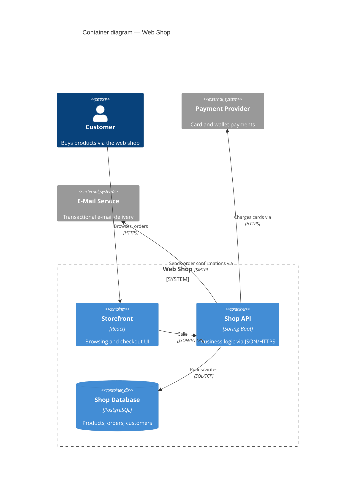

# Architecture — <System Name>

<!--
Copy-paste starting point for a C4 model document (e.g. docs/architecture/).
Replace the Web Shop example with your system. Editing rule: change the
model tables first, then re-derive the diagrams from them — never edit a
diagram directly.
-->

## Model

### Elements

| ID | Element | Type | Technology | Description |
|----|---------|------|------------|-------------|
| customer | Customer | Person | — | Buys products via the web shop |
| shop | Web Shop | Software System (in scope) | — | Lets customers browse the catalog and place orders |
| spa | Storefront | Container | React | Browsing and checkout UI in the browser |
| api | Shop API | Container | Spring Boot | Business logic, exposed via JSON/HTTPS |
| db | Shop Database | Container | PostgreSQL | Products, orders, customers |
| payments | Payment Provider | Software System (external) | — | Card and wallet payments |
| mail | E-Mail Service | Software System (external) | — | Transactional e-mail delivery |

### Relationships

| From | To | Purpose | Technology |
|------|----|---------|------------|
| customer | spa | Browses catalog, places orders | HTTPS |
| spa | api | Calls | JSON/HTTPS |
| api | db | Reads/writes | SQL/TCP |
| api | payments | Charges cards via | HTTPS |
| api | mail | Sends order confirmations via | SMTP |

## System Context diagram

Audience: everyone — shows who uses the system and what it talks to.

## Container diagram

Audience: the team and adjacent technical people — shows the deployable
pieces inside the Web Shop and how they communicate.

Key: blue = part of the Web Shop, gray = external system.
