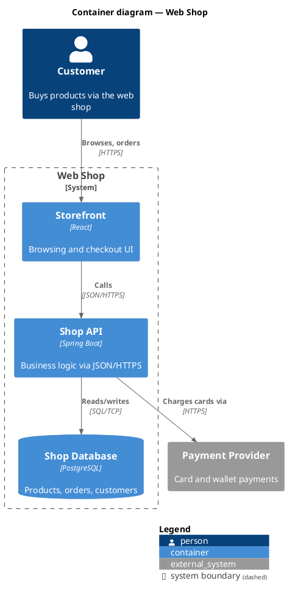

# C4-PlantUML Guide (optional alternative)

C4-PlantUML is the mature, free alternative when Mermaid's output is not
polished enough — slides, print, wikis without Mermaid support. Same model
table, mechanical translation, but it needs a renderer: local PlantUML
(Java) or any [Kroki](https://kroki.io) server. Reach for it only when the
audience needs publication-grade visuals; for in-repo docs, Mermaid's
zero-dependency rendering wins.

## Includes

One include per diagram type, from the PlantUML standard library (bundled
with PlantUML ≥ 2020) or from the C4-PlantUML repo:

```plantuml
@startuml
!include <C4/C4_Context>      ' or C4_Container, C4_Component,
                              '    C4_Dynamic, C4_Deployment
' offline/pinned alternative:
' !include https://raw.githubusercontent.com/plantuml/plantuml-stdlib/master/C4_Container.puml
@enduml
```

Each level's include pulls in the ones below it (`C4_Container` includes
`C4_Context`, etc.).

## Element and relationship macros

Nearly identical to Mermaid's (Mermaid copied this API), so the model table
maps the same way:

```plantuml
Person(alias, "Label", "Description")
Person_Ext(alias, "Label", "Description")
System(alias, "Label", "Description")            System_Ext(...)
SystemDb(...)  SystemQueue(...)
Container(alias, "Label", "Technology", "Description")
ContainerDb(...)  ContainerQueue(...)  Container_Ext(...)
Component(alias, "Label", "Technology", "Description")

System_Boundary(alias, "Label") { ... }
Container_Boundary(alias, "Label") { ... }
Deployment_Node(alias, "Label", "Type") { ... }

Rel(from, to, "Purpose", "Technology")
Rel_U / Rel_D / Rel_L / Rel_R(...)
Rel_Back(from, to, "Purpose", "Technology")
```

## Layout and legend

Where C4-PlantUML beats Mermaid:

- `SHOW_LEGEND()` — auto-generated legend from the element types actually
  used; put it before `@enduml`. Satisfies the checklist's key/legend item
  with one line.
- `LAYOUT_TOP_DOWN()` (default), `LAYOUT_LEFT_RIGHT()`, `LAYOUT_LANDSCAPE()`.
- `LAYOUT_WITH_LEGEND()` — combined layout + legend.
- `SHOW_PERSON_OUTLINE()` — person silhouette instead of a box (nicer for
  non-technical audiences).
- `SetPropertyHeader(...)` / `AddProperty(...)` — key/value tables inside
  elements for deployment details.
- Sprites/icons for technologies via the stdlib icon sets (e.g.
  `tupadr3/devicons2`) — use sparingly; icons supplement text, never replace
  the type/technology label.

## Worked example (Container diagram)



## Rendering (all free)

| Option | Command / URL | Notes |
|---|---|---|
| Local PlantUML | `plantuml -tsvg diagram.puml` (or `java -jar plantuml.jar`) | Needs Java + Graphviz; fully offline |
| Docker | `docker run --rm -v $PWD:/data plantuml/plantuml -tsvg /data/diagram.puml` | No local Java |
| Kroki | `curl -s https://kroki.io/c4plantuml/svg --data-binary @diagram.puml -o diagram.svg` | Self-hostable (`yuzutech/kroki` image) — don't send confidential models to the public instance |
| Editor | VS Code PlantUML extension, IntelliJ plugin | Live preview while drafting |

Commit both the `.puml` source and the exported `.svg` — the source is the
reviewable artifact, the SVG is what non-PlantUML tools display.
