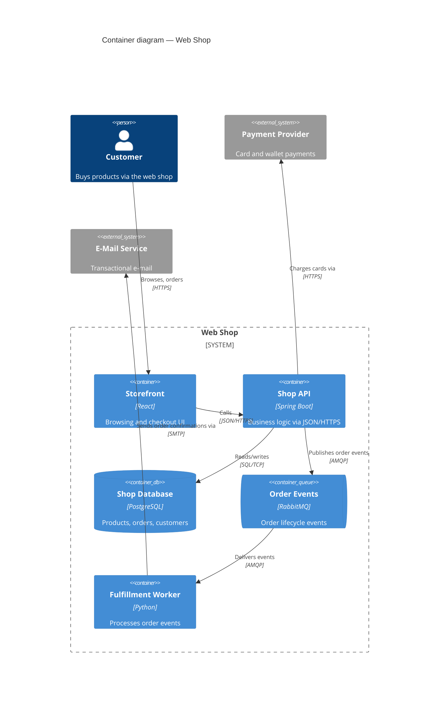
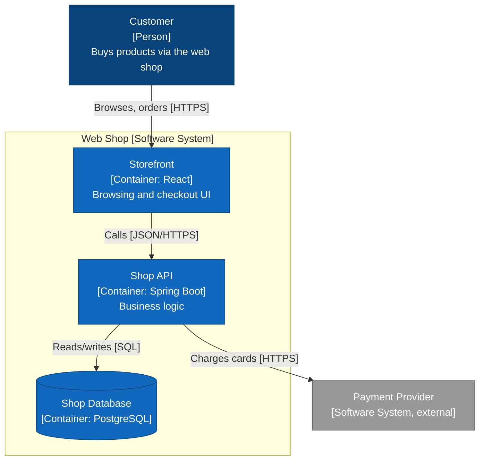

# Mermaid C4 Guide

How to render a C4 model with Mermaid: the dedicated C4 syntax, layout
control, its known limitations, and a styled `flowchart` fallback for when
the C4 syntax gets in the way. Mermaid renders natively on GitHub, GitLab,
VS Code, Obsidian, and most Markdown tools — no toolchain required.

> Mermaid's C4 diagram type is officially **experimental**. It is fine for
> Context and Container diagrams of moderate size; expect friction with deep
> nesting, long labels, and precise layout. When you hit that wall, switch to
> the flowchart fallback below rather than fighting it.

## Diagram types

| Mermaid keyword | C4 diagram |
|---|---|
| `C4Context` | System Context (also usable for System Landscape) |
| `C4Container` | Container |
| `C4Component` | Component |
| `C4Dynamic` | Dynamic (numbered interactions) |
| `C4Deployment` | Deployment |

## Element macros

Signatures (optional arguments in brackets; `alias` is the ID used in
relationships — keep it identical to the model table's ID column):

```
Person(alias, label, [descr])            Person_Ext(...)
System(alias, label, [descr])            System_Ext(...)
SystemDb(alias, label, [descr])          SystemQueue(alias, label, [descr])
Container(alias, label, [techn], [descr])     Container_Ext(...)
ContainerDb(alias, label, [techn], [descr])   ContainerQueue(...)
Component(alias, label, [techn], [descr])     Component_Ext(...)
ComponentDb(alias, label, [techn], [descr])   ComponentQueue(...)
```

Boundaries (grouping boxes):

```
Enterprise_Boundary(alias, label) { ... }
System_Boundary(alias, label) { ... }       // in Container diagrams
Container_Boundary(alias, label) { ... }    // in Component diagrams
Boundary(alias, label, [type]) { ... }      // generic
```

Deployment nodes (Deployment diagrams only):

```
Deployment_Node(alias, label, [type], [descr]) { ... }   // nestable
Node(alias, label, [type], [descr]) { ... }              // synonym
```

The `_Ext` variants render gray — use them for everything outside the system
in scope. That visual in/out distinction is one of the strongest signals a C4
diagram sends; don't skip it.

## Relationships

```
Rel(from, to, label, [techn])       // solid arrow
BiRel(from, to, label, [techn])     // avoid: double-headed hides initiator
Rel_U / Rel_D / Rel_L / Rel_R(...)  // same, with a layout direction hint
Rel_Back(from, to, label, [techn])  // dashed "response/return" arrow
RelIndex(index, from, to, label, [techn])  // C4Dynamic: numbered step
```

Always pass a purpose label, and a technology argument where it matters:
`Rel(spa, api, "Places orders via", "JSON/HTTPS")`.

## Layout and styling

Mermaid C4 auto-layouts; you steer it coarsely:

- `UpdateLayoutConfig($c4ShapeInRow="3", $c4BoundaryInRow="1")` — how many
  shapes/boundaries per row. The single most effective layout knob.
- `Rel_U/D/L/R` direction hints nudge element placement.
- `UpdateElementStyle(alias, $bgColor=..., $fontColor=..., $borderColor=...)`
  — recolor a single element (e.g. highlight the diagram's focus).
- `UpdateRelStyle(from, to, $textColor=..., $lineColor=..., $offsetX=..., $offsetY=...)`
  — recolor/move a relationship label; the offsets fix overlapping labels.
- `title <text>` — always set it (checklist item #1).

## Worked example (Container diagram)



For a Dynamic diagram, use `C4Dynamic` with `RelIndex(1, ...)`,
`RelIndex(2, ...)` to number one use case's steps — one scenario per diagram.

## Known limitations and workarounds

| Limitation | Workaround |
|---|---|
| Coarse layout; elements land in odd rows | `UpdateLayoutConfig`, reorder declarations (order influences placement), `Rel_U/D/L/R` hints |
| Nested boundaries (> 2 levels) render poorly | Flatten: one boundary level per diagram; split the diagram |
| Long labels overflow their boxes | Shorten labels; move detail into the description argument; break with `<br/>` |
| Relationship labels overlap | `UpdateRelStyle(..., $offsetX/$offsetY)` |
| No automatic legend | Add a one-line key under the diagram in Markdown ("gray = external"), or use the flowchart fallback with a legend subgraph |
| No links/tooltips on elements | Put element details in the model table above the diagram |
| Renderer differences (older Mermaid versions) | GitHub tracks recent Mermaid; check with the target renderer early, not after ten diagrams |

## Flowchart fallback (C4-styled)

When the C4 syntax can't express the layout you need, draw a `flowchart` and
keep the C4 *notation rules* (title, typed labels, descriptions, technology,
legend). Use the conventional C4 palette so it still reads as C4:

| Element | Fill | Text |
|---|---|---|
| Person | `#08427b` | white |
| Container / System (in scope) | `#1168bd` | white |
| Component | `#85bbf0` | black |
| External (any) | `#999999` | white |
| Data store | same fill as its level, cylinder shape `[( )]` | |



Keep the `Name<br/>[Type: Technology]<br/>Description` label pattern — it is
the flowchart equivalent of the C4 element macro and what keeps the fallback
checklist-compliant.

## Validating diagrams

Before committing, render every diagram once. Options, cheapest first:

1. Paste into the target renderer (GitHub preview, mermaid.live).
2. `npx -y @mermaid-js/mermaid-cli -i diagram.md -o /tmp/out.svg` — batch
   validation; it exits non-zero on syntax errors.

A diagram that has never been rendered is a diagram with a syntax error.
